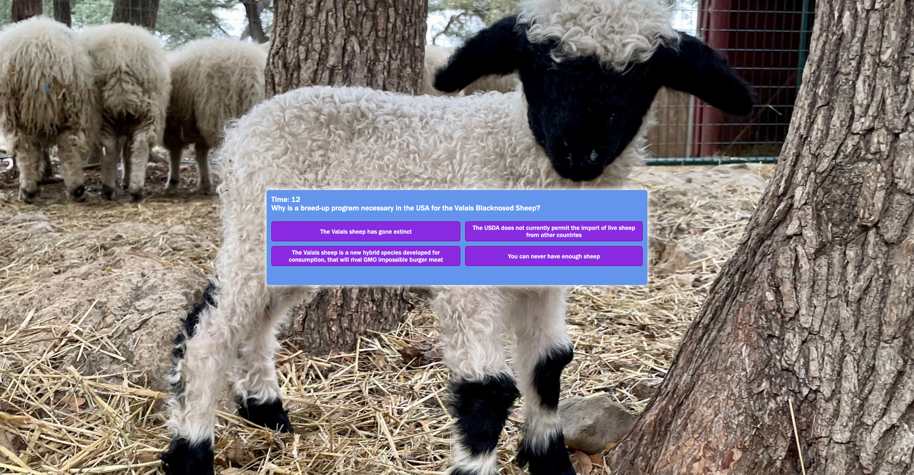

### Valais-Sheep-Quiz

This short quiz will help breeders determine if you have the knowledge needed to undertake your own Valais Sheep breeding program!

## Motivation

The Valais Blacknosed Sheep has been voted the cutest sheep in  the world for the last 10 years in a row! Unfortunately they come from Switzerland and the USA does not allow the import of live sheep. Because of that, sheep lovers in the USA have decided to breed up using imported semen. 

The process can be confusing so new breeders have a ton of questions. Many of the breeders have websites with FAQs to help answer those questions, but it would be even better if they could quiz their visitors with how much information they retained. Then they would be certain that potential breeders have a good grasp of what is involved with breeding up before beginning this involved and expensive program. 

## How it works

Press the start button and begin a series of 5 questions with 4 potential answers. A timer begins counting down from 20 seconds, so you have to move through the questions quickly if you want to finish the quiz on time.

After all questions are answered, you are informed with of how many questions you answered correctly out of 5. 

Play again if you want to improve your score!

